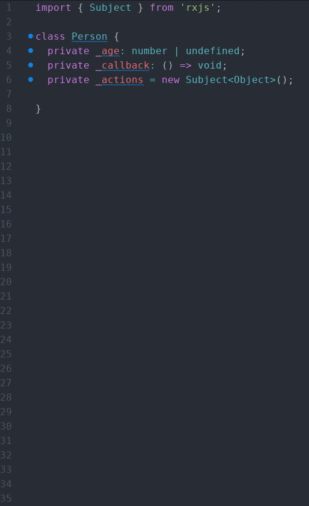

# getset-typescript package

Generate getters and setters of private typescript members automatically.

## Usage
Select all member variables you want ot generate getters and setters for.
Simply press **Cmd+Alt+g** to generate the getters and setters below the selected variables.

|Hints|
|-----|
|Private members must start with an underscore ('_'). |

Only instantiated objects and direct type declarations will be recognized by type. Typed getters and setters will be generated for them; the generated code of members using direct assignments (without specifying the type or using the keyword 'new') won't be typed.

|Member variable| Type of generated getter and setter |
|-----|-----|
|private _name: string;| string |
|private _address: Address = new Address();| Address |
|private _pregnant: boolean = true;| boolean |
|private _pregnant = true;| any |
|private _number;| any |  
|private _newAddress = SOME_CONST_VALUE;| any |
